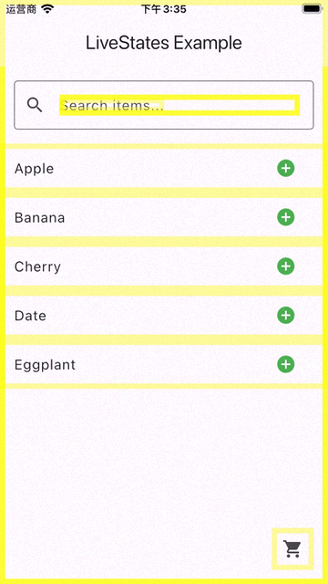
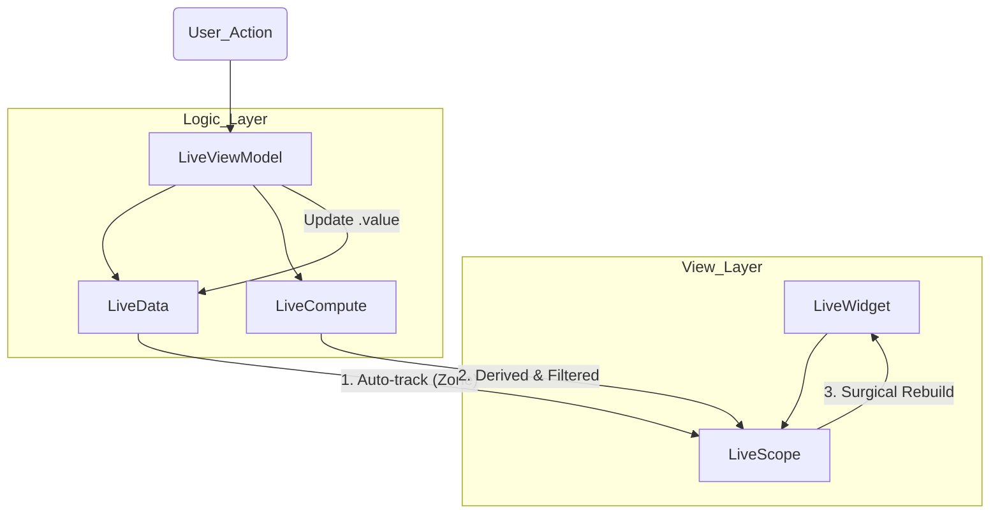

# live_states 🚀

**Stop watching, start living.**  
A surgical precision, high-performance MVVM framework for Flutter that eliminates boilerplate with **Zone-based automatic dependency tracking**.

[](https://pub.dev/packages/live_states)
[](https://opensource.org/licenses/MIT)

---

## 📸 Demo



---

## ✨ The "Aha!" Moment

### 🪄 Implicit vs. Explicit Tracking
Stop manually listing what you want to watch. In other frameworks, missing a `watch` call means your UI stays stale. In `live_states`, if you touch it, we track it.

```dart
// ❌ Traditional (Riverpod/Provider)
// You must explicitly watch every single state. High mental overhead.
final name = ref.watch(nameProvider);
final age = ref.watch(ageProvider);
final score = ref.watch(scoreProvider);
return Text('$name ($age): $score');

// ✅ live_states (Automatic)
// Just access .value. The Zone-based tracker handles the magic.
LiveScope.free(
  builder: (context, _) => Text('${vm.name.value} (${vm.age.value}): ${vm.score.value}')
)
```

### 🎯 Surgical Precision with Zero Effort
Want to rebuild only one `Text` node without triggering a full page re-render? No need to extract widgets or use complex `Selectors`.

```dart
@override
Widget build(BuildContext context, UserVM viewModel) {
  return Scaffold(
    body: Column(
      children: [
        const HeavyStaticWidget(), // This stays static forever
        LiveScope.vm<UserVM>(
          builder: (c, vm, _) => Text('Live Score: ${vm.score.value}'), // Surgical update
        ),
      ],
    ),
  );
}
```

---

## 🌟 Why live_states?

| Feature | **LiveStates** | Provider / Riverpod | Bloc / Redux | GetX |
| :--- | :--- | :--- | :--- | :--- |
| **Tracking** | **Automatic (Zone)** | Manual (`watch`) | Manual (Streams) | Proxy-based |
| **Boilerplate** | **Zero** | Medium | High | Low |
| **Precision** | **Surgical (Scope)** | Widget-level | Widget-level | Component-level |
| **Lifecycle** | **Deep Integration** | Explicit | Independent | Global/Manual |
| **Architecture** | **Pure MVVM** | Functional/DI | Event-driven | Variable |

---

## 🚀 Key Features



- **🪄 Magic Dependency Tracking**: Leveraging Dart's `Zone` mechanism to automatically detect dependencies during the build process. No more manual listeners.
- **🎯 Surgical Rebuilds**: `LiveScope` allows you to isolate updates to the smallest possible Widget node, preventing unnecessary parent re-renders.
- **🏗️ Pure MVVM Architecture**: A clean separation of concerns. Your View talks to the ViewModel, and the ViewModel manages the State.
- **♻️ Deep Lifecycle Hooks**: ViewModels that are actually aware of Flutter's lifecycle (`init`, `dispose`, `activate`, `deactivate`).
- **🧬 Reactive Computing**: `LiveCompute` handles complex derived states with built-in change verification to suppress redundant UI updates.
- **💾 State Persistence**: `Recoverable` mixin allows your VM state to survive widget unmounting and app restarts effortlessly.

---

## 📦 Getting Started

### 1. Define your ViewModel
```dart
class CounterVM extends LiveViewModel<CounterPage> {
  // Define reactive data
  late final counter = LiveData<int>(0, owner);

  // Derived state: only notifies if the BOOLEAN result changes!
  late final isEven = LiveCompute<bool>(owner, () => counter.value % 2 == 0);

  void increment() => counter.value++;
}
```

### 2. Build your View
```dart
class CounterPage extends LiveWidget {
  @override
  CounterVM createViewModel() => CounterVM();

  @override
  Widget build(BuildContext context, CounterVM viewModel) {
    return Scaffold(
      body: Center(
        child: LiveScope.vm<CounterVM>(
          builder: (context, vm, _) => Text('Count: ${vm.counter.value}'),
        ),
      ),
      floatingActionButton: FloatingActionButton(onPressed: viewModel.increment),
    );
  }
}
```

---

## 🛠️ Advanced Tools

### 🔍 Surgical Precision with `LiveScope`
You can pass a `child` to `LiveScope` to prevent it from ever rebuilding, even when the scope itself refreshes.
```dart
LiveScope.vm<MyVM>(
  child: MyComplexStaticWidget(), // This is built once and reused
  builder: (context, vm, child) => Column(
    children: [
      Text(vm.data.value),
      child!, // Never rebuilds
    ],
  ),
)
```

### 💾 State Recovery (`Recoverable`)
Keep your UI state alive even when the user navigates away and back.
```dart
class SearchVM extends LiveViewModel with Recoverable {
  @override
  String get storageKey => 'search_cache';
  
  @override
  Map<String, dynamic>? storage() => {'q': query.value};
  
  @override
  void recover(Map<String, dynamic>? s) => query.value = s?['q'] ?? '';
}
```

### 🔄 Cascaded Refresh (`Refreshable`)
Signal a top-down refresh for an entire tree of ViewModels (perfect for pull-to-refresh).
```dart
class RootVM extends LiveViewModel with Refreshable {
  @override
  Future<bool> onRefresh() async {
    await loadData();
    return true; // All child VMs using Refreshable will also be triggered
  }
}
```

---

## 🧪 Built for Reliability
`live_states` is covered by an extensive test suite ensuring memory safety, zero-leak ticker providers, and accurate dependency resolution.

Check the [Example Project](./example/lib/main.dart) for a full implementation of search filtering and shopping cart logic.

---

## 📄 License
This project is licensed under the MIT License - see the [LICENSE](LICENSE) file for details.
